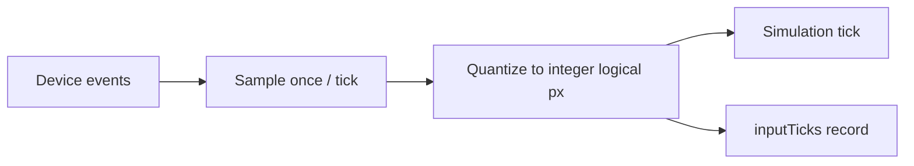

# Input and Remapping

*Reference: `prd.md` Sections 9 (controls) and 30.6 (per-tick input)*

This document is a thin index for the input layer. It describes the input-abstraction
skeleton and remapping model only; concrete default bindings and numeric values live in
the PRD (§9.2-9.4) and the shared schemas in `schemas.md`.

## 1. Input Abstraction

A single device-agnostic input source feeds the simulation. The active device is selected
by `GameConfig.inputMode` (§25):

```ts
// GameConfig.inputMode (§25)
type InputMode =
  | 'keyboard'
  | 'gamepad'
  | 'relative-pointer'
  | 'absolute-pointer'
  | 'touch';
```

Each backend translates raw device events into a uniform per-tick action snapshot
(direction + button edges) so the simulation never sees device specifics. See §9.3 for
relative/absolute pointer behavior and the touch On-Screen Controller, and §9.4 for the
gamepad standard mapping.

```text
keyboard ─┐
gamepad ──┤
pointer ──┼─→ [ InputSource ] ─→ per-tick action snapshot ─→ simulation
touch ────┘
```

## 2. Per-Tick Discipline (§30.6)

The simulation runs at a fixed 60 ticks/s. Input is governed by three rules:

- Input is sampled **exactly once per tick**.
- Analog and pointer values are **quantized to integer logical pixels** before entering
  the simulation (so all backends produce identical integer-domain inputs).
- The replay stores **one record per tick** (`inputTicks[]`, `tickIndex == array index`);
  see `../qa/replay_format.md`.



## 3. Remappable Actions (§9.5)

The following actions are remappable. Defaults are defined in PRD §9.2-9.4 and are **not**
duplicated here.

| Action | Notes |
|---|---|
| Move left / right | Horizontal Vaus movement. |
| Fire / release | Fire laser; release a caught ball. |
| Start / pause | Start game; pause/unpause. |
| Select | Select player count (title / player-select). |
| Mute | Toggle audio mute. |

## 4. Binding Serialization & Persistence

Bindings are serialized as `KeyboardEvent.code` strings plus a gamepad standard-mapping
button index (§8.8), matching the `ISettingsStorage.remaps` shape in `schemas.md`:

```ts
// ISettingsStorage.remaps (see schemas.md)
remaps: {
  keyboard: Record<string, string>; // action → KeyboardEvent.code
  gamepad: Record<string, number>;  // action → standard-mapping button index
}
```

Remaps are persisted in the versioned settings key alongside `GameConfig`; see
`./persistence.md` and the `ISettingsStorage` interface in `./schemas.md`. `inputMode` is a
cosmetic setting and is excluded from `configHash` (§30.7).
