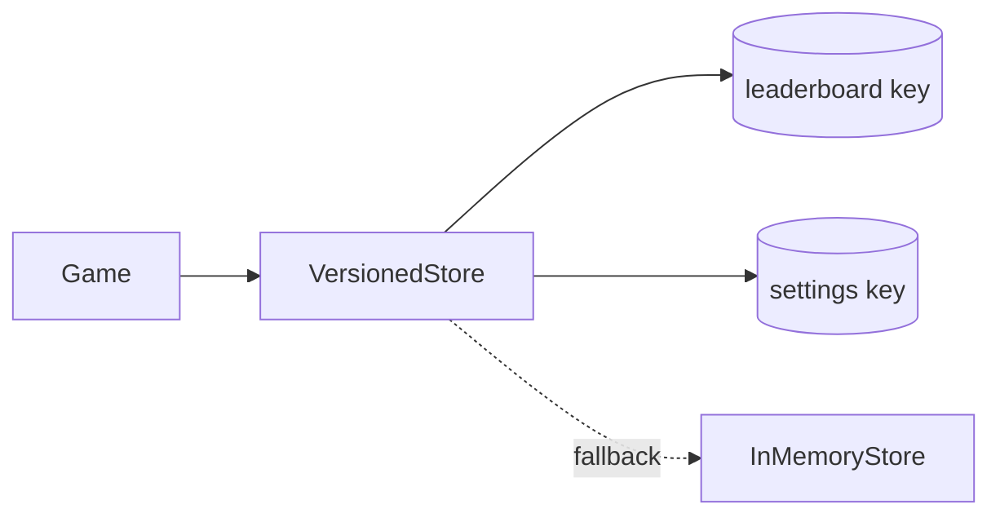

# Persistence and Storage

*Reference: `prd.md` Sections 8.8 and 16.2*

This document is a thin index for the persistence / storage layer. It describes the
storage skeleton only; concrete interfaces and numeric values live in the PRD and in
`schemas.md`.

## 1. Storage Model

A `localStorage`-backed, **versioned** store using **two keys** (§8.8):

- **Leaderboard key** — `{ schemaVersion, entries }`, holding the top-5 scores.
- **Settings key** — `{ schemaVersion, ... }`, holding `GameConfig` (§25) plus control
  remaps (keyboard `KeyboardEvent.code` + gamepad standard-mapping index).



## 2. Interfaces

The concrete schemas are defined in [`schemas.md`](./schemas.md) — do not duplicate them here:

- `ILeaderboardStorage` — `{ schemaVersion, entries }` (entries: `ILeaderboardEntry[]`).
- `ISettingsStorage` — `{ schemaVersion, ... }` (`GameConfig` + control remaps).

## 3. Storage Discipline

- **Validate / clamp on load.** Stored data is untrusted and may be corrupt; each field is
  validated and clamped (e.g. initials clamped to 3 chars per §8.8) before use.
- **Migration.** `schemaVersion` drives migration: on mismatch the store is migrated or
  rejected to a clean default. See PRD §8.8 for the schema contract.
- **Score persistence.** High score persists locally across rounds and sessions (§16.2);
  per-player scores in 2-player mode are runtime state, not persisted.

## 4. Blocked / Unavailable `localStorage` Fallback

When `localStorage` is unavailable (incognito, blocked third-party data), the store degrades
to **in-memory storage** for the current session — no errors thrown — so name-entry and play
still work. This is required by the §34.2 mechanism acceptance test:
*name-entry incl. blocked-`localStorage` fallback*.

```text
load/save -> try localStorage
          -> on unavailable/throw: swap to in-memory backend (session only)
```

A developer/debug reset for leaderboard data is exposed in the settings panel (§8.8).
