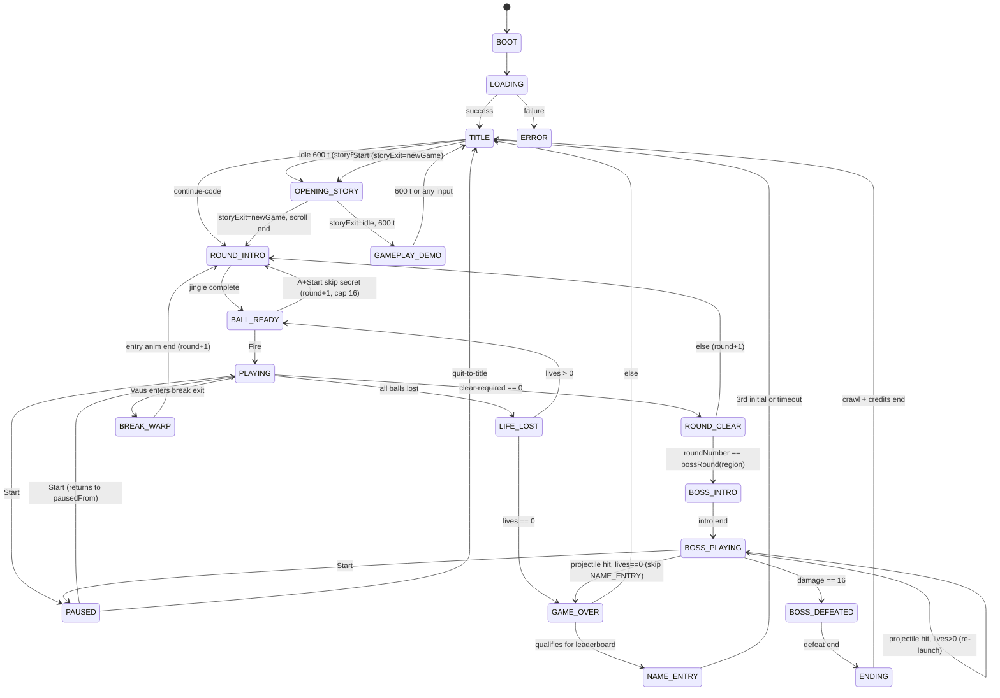

# Game State Machine

*Reference: `prd.md` Section 31 (State Transition Table), Section 19.3 (`GameState` enum)*

This document visualizes the implementation of state transitions defined in the PRD.

## 1. Global Application State

*Note: Refer to PRD Section 31 for specific tick delays and transition durations.*

## 2. Notes
- **Pausable states**: `PLAYING`, `BALL_READY`, `BOSS_PLAYING` only. All simulation timers freeze while paused.
- **PAUSED** records `pausedFrom` on entry and returns to it on resume.
- **GAMEPLAY_DEMO** replays a seeded input log on a fixed round, abortable by any input.
- **TURN_HANDOFF** (2-player) is `[DEFERRED → M3]` per §10.6 and is not part of the M1 single-player flow.
