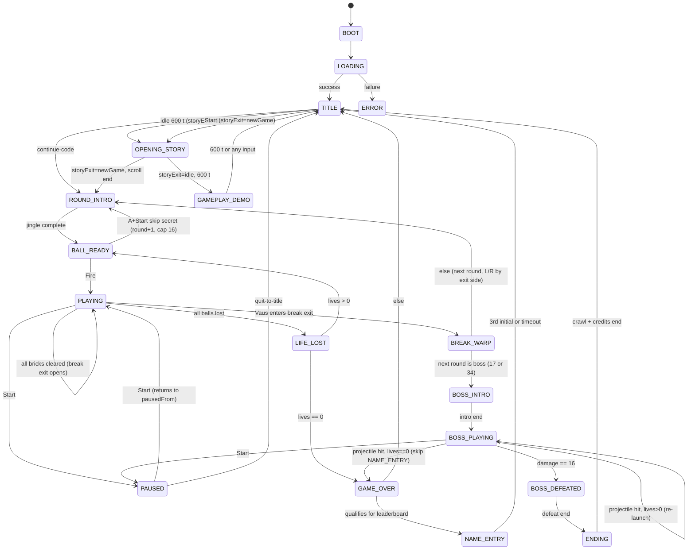

# Game State Machine

*Reference: `prd.md` Section 31 (State Transition Table), Section 19.3 (`GameState` enum)*

This document visualizes the implementation of state transitions defined in the PRD.

## 1. Global Application State

*Note: Refer to PRD Section 31 for specific tick delays and transition durations.*

## 2. Notes
- **Pausable states**: `PLAYING`, `BALL_READY`, `BOSS_PLAYING` only. All simulation timers freeze while paused.
- **PAUSED** records `pausedFrom` on entry and returns to it on resume.
- **GAMEPLAY_DEMO** replays a seeded input log on a fixed round, abortable by any input.
- **TURN_HANDOFF** (2-player) is `[DEFERRED → M3]` per §10.6 and is not part of the M1 single-player flow.
- **Boss rounds**: DOH appears as two encounters — a mid-game boss at Round 17 and the final boss at Round 34 (`boot.ts:294` treats both identically). `BOSS_INTRO` is entered when `roundNumber ∈ {17, 34}`; the Round 17 boss returns to normal play (Round 18), the Round 34 boss leads to `ENDING`.
- **L/R branching**: rounds 2–16 and 19–33 have L/R layout variants (`round-NNL.json` / `round-NNR.json`). The branch is selected on stage exit — entering the break-warp on the left vs. right side emits branch `L` vs. `R` (`roundState.ts:122-126`), which sets `currentRoundBranch` for the next round load (`boot.ts:340`, `assetLoader.ts:8`).
- **Stage clear uses the break-exit mechanism**: clearing all required bricks opens the break exit (`isBreakWarpOpen=true`, `BREAK_WARP_OPENED`, `roundState.ts:242-248`) rather than firing a distinct `ROUND_CLEAR` transition. The player then leaves through the left/right exit, which both advances the round and picks the L/R branch. The `ROUND_CLEAR` enum value exists but is never entered (`changeState('ROUND_CLEAR')` is absent); `BREAK_WARP` is the single advance path.
