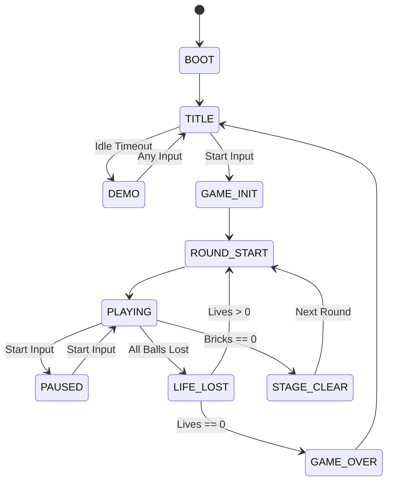

# Game State Machine

*Reference: `prd.md` Section 31 (State Transition Table)*

This document visualizes the implementation of state transitions defined in the PRD.

## 1. Global Application State

*Note: Refer to PRD Section 31 for specific tick delays and transition triggers.*
